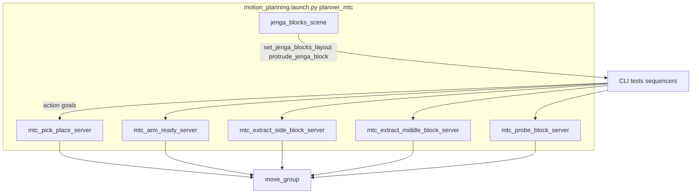

# jenga_interfaces

ROS 2 interface definitions for Jenga manipulation: **actions** implemented by MoveIt Task Constructor (MTC) servers in `mtc_jenga_servers`, and **services** implemented by `jenga_blocks_scene` in `motion_planning` for planning-scene layout and tests.

This package defines types only; servers are started via launch files described below.

## Build

```bash
cd ~/ros2_ws
source /opt/ros/humble/setup.bash
colcon build --packages-select jenga_interfaces
source install/setup.bash
```

Depend on this package in `package.xml` with `<depend>jenga_interfaces</depend>` (or `build_depend` / `exec_depend` as appropriate).

## Actions

Source files live under `action/`. Generated Python/C++ types follow `jenga_interfaces/action/<Name>.action`.

| Action | Purpose (summary) |
|--------|-------------------|
| `JengaPickPlace` | Pick at `pick_pose`, place at `place_pose`; `block_index` labels the step. |
| `JengaArmReady` | Move arm to a named SRDF state (optional `target_state`; empty uses server default). |
| `JengaExtractSideBlock` | Extract a block from the side of the tower; `block_pose`, `place_pose`, `block_index`. |
| `JengaExtractMiddleBlock` | Extract from the middle; includes `extract_axis` (e.g. `"x"`, `"-x"`; empty → server auto-detect). |
| `JengaProbeBlock` | FT-guided probe; result includes `probe_outcome`, `score`, `displacement_m`, `max_force_n`. |

Each action follows the usual ROS 2 pattern: **Goal**, **Result** (`success`, `message`, `error_code`, plus action-specific fields), **Feedback** (`current_stage`, `progress_pct`).

See the `.action` files for exact field types:

- [`action/JengaPickPlace.action`](action/JengaPickPlace.action)
- [`action/JengaArmReady.action`](action/JengaArmReady.action)
- [`action/JengaExtractSideBlock.action`](action/JengaExtractSideBlock.action)
- [`action/JengaExtractMiddleBlock.action`](action/JengaExtractMiddleBlock.action)
- [`action/JengaProbeBlock.action`](action/JengaProbeBlock.action)

## Services

| Service | File | Purpose |
|---------|------|---------|
| `SetJengaBlocksLayout` | [`srv/SetJengaBlocksLayout.srv`](srv/SetJengaBlocksLayout.srv) | Republish selected `block_indices` (or all if empty) at `target_layout`: `"stock"` or `"tower"` (planning scene only). |
| `ProtrudeJengaBlock` | [`srv/ProtrudeJengaBlock.srv`](srv/ProtrudeJengaBlock.srv) | Shift one block’s collision object by `distance_m` along `axis` for `block_index` (planning scene only). |

Both are implemented by `jenga_blocks_scene` in `motion_planning` as `set_jenga_blocks_layout` and `protrude_jenga_block`.

## Prerequisites

Before sending action goals:

- **`move_group`** running with **ExecuteTaskSolutionCapability** (`/execute_task_solution` must exist).
- Robot driver and **joint states** publishing.
- Planning scene and TF aligned with your setup (`world` frame for block collision objects; set `publish_world_to_base_tf` on integrated launch if needed — see [motion_planning README](../motion_planning/README.md)).
- **Concurrency:** do not send goals to two MTC action servers at the same time; they share execution through `move_group`.

## Bring up servers

### Integrated (recommended)

Starts all five MTC action servers plus `jenga_blocks_scene` (planning-scene services). Start **after** MoveIt and the robot are running:

```bash
ros2 launch motion_planning motion_planning.launch.py planner:=mtc
```

MTC-relevant launch arguments:

| Launch arg | Default | Role |
|------------|---------|------|
| `planner` | `mtc` | Must be `mtc` to start MTC servers and `jenga_blocks_scene` |
| `mtc_server_mode` | `paired_pose` | Pick/place server only: `paired_pose` (two `/goal_pose` = pick then place) or `single_pose` (MoveGroup to each pose) |
| `jenga_blocks_startup_layout` | `none` | `none`, `stock`, or `tower` — publish all block collision objects at startup |
| `jenga_blocks_layout_path` | package `jenga_tower_mtc_layout.yaml` | YAML layout for block poses |
| `jenga_blocks_frame_id` | `world` | TF frame for block collision objects |
| `max_velocity_scaling_factor` | `0.1` | Overrides YAML for all MTC servers |
| `max_acceleration_scaling_factor` | `0.1` | Same |

Example with common overrides:

```bash
ros2 launch motion_planning motion_planning.launch.py planner:=mtc \
  jenga_blocks_startup_layout:=tower \
  max_velocity_scaling_factor:=0.2
```

For full-stack options (e-stop, exclusion zones, TF), see [motion_planning README](../motion_planning/README.md).

### Standalone MTC launches

Use when `move_group` is already up and you only need specific servers. These do **not** start `jenga_blocks_scene` unless you run it separately.

| Launch file | Package | Purpose |
|-------------|---------|---------|
| `mtc_server.launch.py` | `mtc_jenga_servers` | Pick/place only |
| `mtc_extract_servers.launch.py` | `mtc_jenga_servers` | Side and/or middle extract |
| `mtc_probe_server.launch.py` | `mtc_jenga_servers` | Probe only |

**`mtc_server.launch.py`** ([`mtc_jenga_servers/launch/mtc_server.launch.py`](../mtc_jenga_servers/launch/mtc_server.launch.py)):

| Launch arg | Default | Description |
|------------|---------|-------------|
| `mode` | `single_pose` | `single_pose` or `paired_pose` |
| `status_topic` | `mtc_status` | JSON status topic |
| `max_velocity_scaling_factor` | `0.1` | Joint velocity scale (0, 1] |
| `max_acceleration_scaling_factor` | `0.1` | Joint acceleration scale (0, 1] |

```bash
ros2 launch mtc_jenga_servers mtc_server.launch.py mode:=paired_pose
```

**`mtc_extract_servers.launch.py`**:

| Launch arg | Default | Description |
|------------|---------|-------------|
| `which` | `side` | `side`, `middle`, or `both` |
| `arm_group` | `ur_onrobot_manipulator` | MoveIt arm group |
| `hand_group` | `ur_onrobot_gripper` | MoveIt hand group |
| `gripper_tcp` | `gripper_tcp` | End-effector frame |
| `max_velocity_scaling_factor` | `0.1` | Velocity scale |
| `max_acceleration_scaling_factor` | `0.1` | Acceleration scale |

```bash
ros2 launch mtc_jenga_servers mtc_extract_servers.launch.py which:=both
```

**`mtc_probe_server.launch.py`**:

| Launch arg | Default | Description |
|------------|---------|-------------|
| `arm_group` | `ur_onrobot_manipulator` | MoveIt arm group |
| `gripper_tcp` | `gripper_tcp` | End-effector frame |
| `probe_frame` | `probe_tip` | Probe tip frame |
| `use_sim_block_attach` | `true` | Attach probed block to probe during push (sim) |
| `max_velocity_scaling_factor` | `0.1` | Velocity scale |
| `max_acceleration_scaling_factor` | `0.1` | Acceleration scale |

```bash
ros2 launch mtc_jenga_servers mtc_probe_server.launch.py use_sim_block_attach:=false
```

**`mtc_arm_ready_server`** has no standalone launch file. Use integrated bringup above, or:

```bash
ros2 run mtc_jenga_servers mtc_arm_ready_server --ros-args \
  --params-file $(ros2 pkg prefix mtc_jenga_servers)/share/mtc_jenga_servers/config/mtc_velocity_scaling.yaml
```

### Default action names

| Server executable | Default action name | Interface type |
|-------------------|---------------------|----------------|
| `mtc_pick_place_server` | `jenga_pick_place` | `JengaPickPlace` |
| `mtc_arm_ready_server` | `jenga_arm_ready` | `JengaArmReady` |
| `mtc_extract_side_block_server` | `jenga_extract_side_block` | `JengaExtractSideBlock` |
| `mtc_extract_middle_block_server` | `jenga_extract_middle_block` | `JengaExtractMiddleBlock` |
| `mtc_probe_block_server` | `jenga_probe_block` | `JengaProbeBlock` |

Resolved names are typically absolute (e.g. `/jenga_pick_place`). Override with each server’s `action_name` ROS parameter.



## Calling services

Services are provided by **`jenga_blocks_scene`**, not by `jenga_interfaces` itself. They are available when `motion_planning.launch.py` runs with `planner:=mtc`, or when you run `jenga_blocks_scene` manually.

| Service name | Type | When available |
|--------------|------|----------------|
| `set_jenga_blocks_layout` | `SetJengaBlocksLayout` | Integrated MTC bringup, or `ros2 run motion_planning jenga_blocks_scene` |
| `protrude_jenga_block` | `ProtrudeJengaBlock` | Same |

Services only update the **MoveIt planning scene**; they do not move Gazebo models or physical blocks.

```bash
# Full tower or stock layout (block_indices: [] = all blocks)
ros2 service call /set_jenga_blocks_layout jenga_interfaces/srv/SetJengaBlocksLayout \
  "{block_indices: [], target_layout: 'tower'}"

ros2 service call /set_jenga_blocks_layout jenga_interfaces/srv/SetJengaBlocksLayout \
  "{block_indices: [], target_layout: 'stock'}"

# Reset specific blocks only
ros2 service call /set_jenga_blocks_layout jenga_interfaces/srv/SetJengaBlocksLayout \
  "{block_indices: [10, 11], target_layout: 'stock'}"

# Offset one block (used before middle-block extract tests)
ros2 service call /protrude_jenga_block jenga_interfaces/srv/ProtrudeJengaBlock \
  "{block_index: 10, distance_m: 0.01, axis: 'x'}"
```

`target_layout` must be `"stock"` or `"tower"`.

## Calling actions

### CLI (minimal)

Only **`JengaArmReady`** is practical for a raw `ros2 action send_goal` without constructing poses:

```bash
ros2 action send_goal /jenga_arm_ready jenga_interfaces/action/JengaArmReady "{target_state: ''}"
```

For pose-heavy actions (`JengaPickPlace`, extract, probe), inspect fields with:

```bash
ros2 interface show jenga_interfaces/action/JengaPickPlace
```

Prefer the packaged test nodes below rather than hand-authored goal YAML.

### Goal / result cheat sheet

| Action | Goal fields | Result extras |
|--------|-------------|---------------|
| `JengaPickPlace` | `block_index`, `pick_pose`, `place_pose` | — |
| `JengaArmReady` | `target_state` (empty → server default) | — |
| `JengaExtractSideBlock` | `block_index`, `block_pose`, `place_pose` | — |
| `JengaExtractMiddleBlock` | `block_index`, `block_pose`, `place_pose`, `extract_axis` | — |
| `JengaProbeBlock` | `block_index`, `block_pose` | `probe_outcome` (0=UNKNOWN, 1=LOOSE, 2=STUCK, 3=ERROR), `score`, `displacement_m`, `max_force_n` |

All actions share result fields `success`, `message`, `error_code` and feedback `current_stage`, `progress_pct`.

### Recommended helpers (`motion_planning`)

Require the MTC stack and MoveIt running. Workspace must be sourced.

| Command | Action(s) | Notable `--ros-args` params |
|---------|-----------|-----------------------------|
| `ros2 run motion_planning test_mtc_pick_place` | `JengaPickPlace` | `block_index`, `action_name`, `goal_frame`, `layout_path` |
| `ros2 run motion_planning test_mtc_extract_side` | `JengaExtractSideBlock` | `action_name`, `goal_frame` |
| `ros2 run motion_planning test_mtc_extract_middle` | `JengaExtractMiddleBlock` | `action_name`, `goal_frame`, `extract_axis` |
| `ros2 run motion_planning test_mtc_extract_middle_protruded` | `JengaExtractMiddleBlock` | `block_index`, `protrude_distance_m`, `protrude_axis`; calls `protrude_jenga_block` first |
| `ros2 run motion_planning test_mtc_probe_block` | `JengaProbeBlock` | `block_index`, `action_name`, `goal_frame`, `planning_scene_topic` |
| `ros2 run motion_planning jenga_tower_mtc_sequencer` | `JengaPickPlace`, `JengaArmReady` | `layout_path`, `action_name`, `ready_action_name`, timeouts |
| `ros2 run motion_planning jenga_extract_middle_to_top_sequencer` | extract + pick/place | `block_index`, `extract_action_name`, `pick_place_action_name`, handoff offsets |

Examples:

```bash
ros2 run motion_planning test_mtc_pick_place --ros-args -p block_index:=5 -p goal_frame:=world
ros2 run motion_planning test_mtc_probe_block --ros-args -p block_index:=10 -p goal_frame:=world
ros2 run motion_planning jenga_tower_mtc_sequencer --ros-args -p pre_wait_sec:=8.0
```

## Usage from code

After sourcing the workspace:

```python
from jenga_interfaces.action import JengaPickPlace, JengaArmReady, JengaProbeBlock
from jenga_interfaces.srv import SetJengaBlocksLayout, ProtrudeJengaBlock
```

## See also

- [motion_planning README](../motion_planning/README.md) – full-stack launch, MTC prerequisites, RMRC, exclusion zones, sequencers
- [mtc_jenga_servers README](../mtc_jenga_servers/README.md) – C++ action servers, velocity YAML tuning
