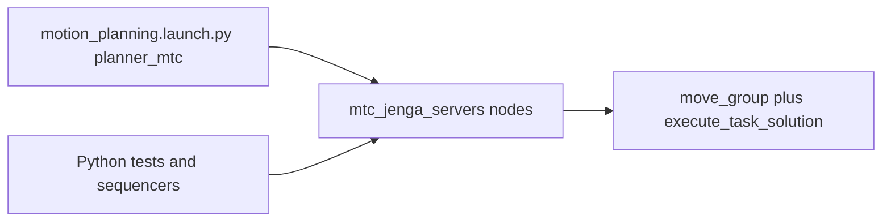

# motion_planning

ROS2 package for motion planning with a UR3e: pose goals, RMRC (Resolved Motion Rate Control), exclusion zones, and MoveIt2 integration. Executes planned trajectories via the `ur3e_controller` move client.

## Features

- **Pose goal node** – Cartesian pose goals via MoveIt2 (IK + planning + execution)
- **RMRC planner** – Jacobian-based Cartesian planning with potential-field collision avoidance (no MoveIt GUI)
- **Exclusion zones** – No-go regions (boxes, spheres) loaded from YAML or added in code
- **E-stop integration** – Works with `ur3e_controller` estop node to cancel trajectories
- **MoveIt Task Constructor (MTC)** – Jenga pick/place, extract, probe, and arm-ready actions via `mtc_jenga_servers` when `planner:=mtc` (default in `motion_planning.launch.py`)

## Requirements

- ROS2 Humble
- `ur3e_controller` (for trajectory execution)
- `ur_moveit_config` (when using MoveIt pose goal node)
- `ur_description` (for RMRC)
- For **MTC**: `jenga_interfaces`, `mtc_jenga_servers`, `moveit_task_constructor`, and a MoveIt config that matches your robot (e.g. `ur_onrobot_moveit_config` with gripper groups)
- Python/ROS deps: `numpy`, `python3-pykdl`, `kdl_parser_py`, `urdf_parser_py`, `yaml`

## Build

```bash
source /opt/ros/humble/setup.bash  # or iron
colcon build --packages-select jenga_interfaces mtc_jenga_servers motion_planning
source install/setup.bash
```

## Nodes

| Node                   | Description                                                              |
|------------------------|--------------------------------------------------------------------------|
| `pose_goal_node`       | MoveIt2 pose goals; plans and executes via `/move_action`               |
| `rmrc_planning_node`   | RMRC Cartesian planner; no MoveIt; uses PyKDL Jacobian + repulsion     |
| `exclusion_zones_node` | Loads exclusion zones from YAML into the MoveIt planning scene         |
| `test_rmrc_pose`       | Test script that publishes sample goal poses                            |
| `robot_gui`            | GUI for robot interaction                                               |
| `jenga_blocks_scene`   | Publishes Jenga block boxes to the MoveIt planning scene (MTC workflows) |

### `jenga_blocks_scene` services

Started when `motion_planning.launch.py` runs with `planner:=mtc`. Services only update the **MoveIt planning scene**; they do not move Gazebo models or real blocks.

By default (`jenga_blocks_startup_layout:=none`), no blocks are published at startup. Use `jenga_blocks_startup_layout:=stock` or `:=tower` to spawn all blocks on launch, or call `set_jenga_blocks_layout` at runtime.

| Service | Type | Effect |
|---------|------|--------|
| `set_jenga_blocks_layout` | `jenga_interfaces/srv/SetJengaBlocksLayout` | Republish selected `block_indices` (or all if empty) at either `target_layout: "stock"` or `"tower"` (planning scene only). |
| `protrude_jenga_block` | `jenga_interfaces/srv/ProtrudeJengaBlock` | Move one block’s collision object along an axis by `distance_m` (planning scene only; used by extraction tests). |

Example:

```bash
# Full tower or stock layout
ros2 service call /set_jenga_blocks_layout jenga_interfaces/srv/SetJengaBlocksLayout "{block_indices: [], target_layout: 'tower'}"
ros2 service call /set_jenga_blocks_layout jenga_interfaces/srv/SetJengaBlocksLayout "{block_indices: [], target_layout: 'stock'}"

# Reset only specific indices (example: put block_10 and block_11 back to stock)
ros2 service call /set_jenga_blocks_layout jenga_interfaces/srv/SetJengaBlocksLayout "{block_indices: [10, 11], target_layout: 'stock'}"
```

## Launch

### Main launch file

Start this **after** the robot and (optionally) MoveIt2 are running:

```bash
ros2 launch motion_planning motion_planning.launch.py
```

**Parameters:**

| Parameter                 | Default                            | Description                                          |
|---------------------------|------------------------------------|------------------------------------------------------|
| `use_rmrc`                | `true`                             | Use RMRC instead of MoveIt pose_goal_node            |
| `exclusion_zones_file`    | `config/ur3e_workspace.yaml`       | Path to YAML defining exclusion zones               |
| `plan_only`               | `false`                            | Plan only, do not execute                            |
| `execution_start_delay`   | `1.0`                              | RMRC-only: delay added before first trajectory point to avoid startup tolerance trips |
| `goal_time_tolerance`     | `2.0`                              | RMRC-only: extra time allowed for controller to settle at goal |
| `max_joint_velocity`      | `0.25`                             | RMRC-only: clamp generated joint velocities (rad/s) |
| `max_joint_acceleration`  | `0.5`                              | RMRC-only: clamp generated joint acceleration (rad/s²) |
| `execution_mode`          | `trajectory`                       | RMRC execution mode: `trajectory` or `velocity`      |
| `kinematics_backend`      | `hybrid`                           | `pykdl` or `hybrid` (PyKDL + optional analytical IK helper) |
| `velocity_command_topic`  | `/joint_group_velocity_controller/commands` | Topic used when `execution_mode:=velocity` |
| `ik_seed_gain`            | `0.0`                              | Null-space bias gain toward analytical IK candidate   |
| `publish_world_to_base_tf`| `false`                            | Publish static `world -> base_link` TF from this launch (keep false when robot launch already provides it) |
| `base_height`             | `1.08`                             | Z offset (m) used for static `world -> base_link` TF |
| `add_floor_plane`         | `false`                            | Add floor-plane at startup (use GUI or `:=true` + `world` frame if needed) |
| `floor_z`                  | `0.0`                              | Floor Z height (metres)                              |
| `jenga_blocks_startup_layout` | `none`                          | MTC only: `none` (default), `stock`, or `tower` — publish all Jenga block collision objects at startup |

**Examples:**

```bash
# With custom exclusion zones
ros2 launch motion_planning motion_planning.launch.py exclusion_zones_file:=/path/to/zones.yaml

# RMRC planning (no MoveIt GUI)
ros2 launch motion_planning motion_planning.launch.py use_rmrc:=true

# RMRC local velocity servo mode (for fine manipulation/contact tasks)
ros2 launch motion_planning motion_planning.launch.py use_rmrc:=true execution_mode:=velocity
```

### Standalone exclusion zones loader

If you run pose/RMRC planning separately:

```bash
ros2 run motion_planning exclusion_zones_node --ros-args -p exclusion_zones_file:=/path/to/zones.yaml
```

## MoveIt Task Constructor (MTC)

Integrated Jenga manipulation uses **actions** from [`jenga_interfaces`](../jenga_interfaces/README.md), implemented by C++ servers in [`mtc_jenga_servers`](../mtc_jenga_servers/README.md). Launching `motion_planning.launch.py` with `planner:=mtc` (the default) starts the MTC server nodes together with `jenga_blocks_scene`, exclusion zones, and e-stop.



### Prerequisites

- **Driver** and **robot_state_publisher** / joint states running.
- **`move_group`** on the same `ROS_DOMAIN_ID`, with **ExecuteTaskSolutionCapability** loaded (`/execute_task_solution` must exist).
- Planning groups and frames match your SRDF (defaults assume ur_onrobot-style names; override via server parameters if needed).
- **`joint_trajectory_action`** passed into `motion_planning.launch.py` must match the active arm trajectory action (e.g. scaled vs non-scaled controller) for `estop_node`.
- Set **`publish_world_to_base_tf`**, **`base_height`**, **`base_yaw`** so `world` and collision objects align with your TF tree.

### Launch (full stack node)

Start **after** MoveIt and the robot are up (or use `ur_onrobot_mtc_bringup.launch.py` from the repo root README):

```bash
ros2 launch motion_planning motion_planning.launch.py planner:=mtc \
  joint_trajectory_action:=/scaled_joint_trajectory_controller/follow_joint_trajectory \
  publish_world_to_base_tf:=true base_height:=0.0 base_yaw:=0.0
```

### `mtc_server_mode` (pick/place server only)

| Value | Behavior |
|-------|----------|
| `paired_pose` | **Default.** Two consecutive `/goal_pose` messages are interpreted as pick then place for the MTC pick/place pipeline. |
| `single_pose` | Each `/goal_pose` triggers a direct MoveGroup-style move (no paired pick/place sequence). |

### Concurrency

Do **not** send goals to two MTC action servers at the same time. Servers share execution through `move_group`; overlapping goals can race on `/execute_task_solution`.

### Actions (interface reference)

| Action server node | Action name | Message type |
|--------------------|-------------|--------------|
| `mtc_pick_place_server` | `jenga_pick_place` | `jenga_interfaces/action/JengaPickPlace` |
| `mtc_arm_ready_server` | `jenga_arm_ready` | `jenga_interfaces/action/JengaArmReady` |
| `mtc_extract_side_block_server` | `jenga_extract_side_block` | `jenga_interfaces/action/JengaExtractSideBlock` |
| `mtc_extract_middle_block_server` | `jenga_extract_middle_block` | `jenga_interfaces/action/JengaExtractMiddleBlock` |
| `mtc_probe_block_server` | `jenga_probe_block` | `jenga_interfaces/action/JengaProbeBlock` |

Override the advertised name with each server’s `action_name` parameter if needed.

### Calling actions from the CLI

Smoke testing is easiest with the Python entry points below. For a minimal raw action example (small goal):

```bash
ros2 action send_goal /jenga_arm_ready jenga_interfaces/action/JengaArmReady "{target_state: ''}"
```

Other actions require `PoseStamped` goals; use `ros2 interface show jenga_interfaces/action/JengaPickPlace` for field layout, or prefer the packaged test nodes.

### Test / helper executables

Run with the workspace sourced and the MTC stack (and MoveIt) running.

| Command | Action exercised | Notes |
|---------|------------------|--------|
| `ros2 run motion_planning test_mtc_pick_place` | `JengaPickPlace` | Params: `action_name`, `goal_frame`, `start_with_home_joints`, `end_with_home_joints`, `joint_trajectory_action`, `joint_home_duration_sec`, … |
| `ros2 run motion_planning test_mtc_extract_side` | `JengaExtractSideBlock` | Params: `action_name`, `goal_frame` |
| `ros2 run motion_planning test_mtc_extract_middle` | `JengaExtractMiddleBlock` | Params: `action_name`, `goal_frame` |
| `ros2 run motion_planning test_mtc_extract_middle_protruded` | `JengaExtractMiddleBlock` | Sets tower scene, calls `protrude_jenga_block`, then extracts. Params include `block_index`, `protrude_distance_m`, `protrude_axis`, `layout_path`, `planning_scene_topic`, `extract_axis`, … |
| `ros2 run motion_planning test_mtc_probe_block` | `JengaProbeBlock` | Calls `set_jenga_blocks_layout` with tower layout (planning scene only), reads `block_{index}` pose from `planning_scene_topic`, sends probe goal. Params: `action_name`, `goal_frame`, `block_index`, `planning_scene_topic`, `scene_timeout_sec`, `tf_timeout_sec` |
| `ros2 run motion_planning mtc_action_client` | `JengaPickPlace` | Minimal one-shot pick/place with built-in default poses; overlaps with `test_mtc_pick_place` |

Example:

```bash
ros2 run motion_planning test_mtc_probe_block --ros-args -p block_index:=10 -p goal_frame:=world
```

### Sequencers

| Command | Description |
|---------|-------------|
| `ros2 run motion_planning jenga_tower_mtc_sequencer` | Sends a sequence of `JengaPickPlace` goals for a six-layer tower (parametric or YAML-driven). Calls `jenga_arm_ready` at start and end. Params: `layout_path`, `action_name`, `ready_action_name`, `goal_frame`, `pre_wait_sec`, `step_pause_sec`, `per_goal_timeout_sec`, `per_ready_timeout_sec`. Default layout: `config/jenga_tower_mtc_layout.yaml`. |
| `ros2 run motion_planning jenga_extract_middle_to_top_sequencer` | Pipeline: arm ready → extract middle → pick/place to tower top. Params include `block_id` or `block_index`, `goal_frame`, `arm_ready_action_name`, `extract_action_name`, `pick_place_action_name`, `layout_path`, timeouts, `handoff_dx` / `handoff_dy` / `handoff_dz`, tower matching tolerances. Optional manual top placement: `place_top_indices` (int array `[layer, slot]`, default `[-1,-1]` for auto) or `place_top_layer` / `place_top_slot` (both `-1` for auto); slot is `0 … blocks_per_layer-1` like the auto-detector logs. |

Example tower build:

```bash
ros2 run motion_planning jenga_tower_mtc_sequencer --ros-args -p pre_wait_sec:=8.0
```

## Sending goal poses

**Topic:** `/goal_pose` (`geometry_msgs/PoseStamped`)

```bash
ros2 topic pub --once /goal_pose geometry_msgs/msg/PoseStamped \
  "{header: {frame_id: 'base_link'}, pose: {position: {x: 0.3, y: 0.0, z: 0.4}, orientation: {w: 1.0}}}"
```

**Service:** `/execute_last_goal_pose` (`std_srvs/Trigger`) – execute the last pose set on `/goal_pose`.

## Exclusion zones

Exclusion zones are collision objects (boxes or spheres) added to the MoveIt planning scene so the robot plans around them.

### YAML schema

```yaml
exclusion_zones:
  - type: box
    id: cabinet_body
    frame_id: base_link
    position: [x, y, z]
    size: [x, y, z]

  - type: sphere
    id: tower_zone
    frame_id: base_link
    center: [x, y, z]
    radius: 0.1
```

### Runtime control

```bash
ros2 topic pub --once /remove_exclusion_zone std_msgs/msg/String "data: cabinet_body"
ros2 topic pub --once /add_exclusion_zone    std_msgs/msg/String "data: cabinet_body"
```

### Use from code

```python
from motion_planning.moveit_planning import MoveItPlanningInterface
# add_exclusion_zone_box(), add_exclusion_zone_sphere()

from motion_planning.exclusion_zones_loader import apply_exclusion_zones_to_scene
# apply_exclusion_zones_to_scene(scene, zones_from_yaml)
```

## RMRC vs MoveIt

| Aspect        | MoveIt (`use_rmrc:=false`)      | RMRC (`use_rmrc:=true`)        |
|---------------|----------------------------------|---------------------------------|
| GUI           | RViz + MoveIt                   | Optional; can run headless      |
| Planning      | OMPL                            | PyKDL Jacobian + potential field |
| Dependencies  | MoveIt2, move_group              | `ur_description` only           |
| Use case      | Full planning pipeline          | Fast Cartesian, no MoveIt stack  |

## See also

- [ur3e_controller](../ur3e_controller/README.md) – joint control, sim launch files, move client API
- [jenga_interfaces](../jenga_interfaces/README.md) – action and service definitions
- [mtc_jenga_servers](../mtc_jenga_servers/README.md) – MTC action server nodes and standalone launches
